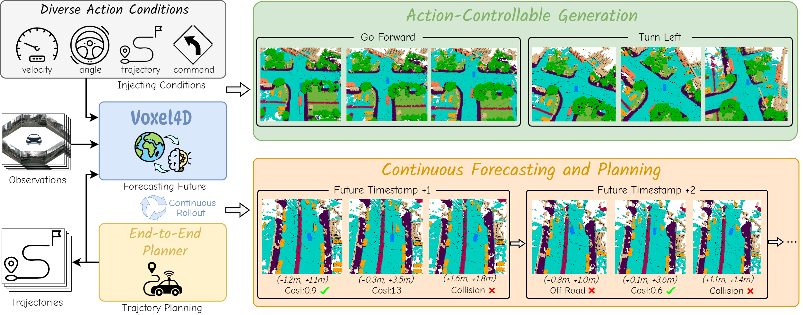
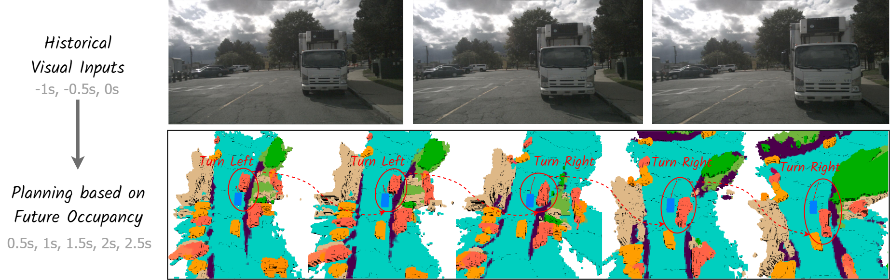
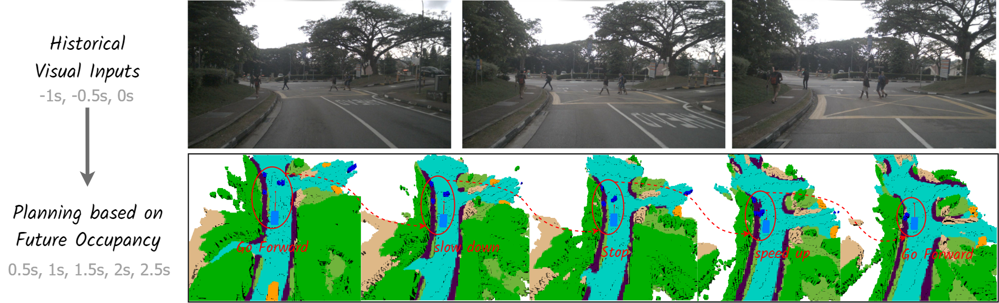

# Voxel4D: Vision-Centric 4D Occupancy Forecasting and Planning via World Models for Autonomous Driving

[](https://rtennety.github.io/Voxel4D/)

> **Author:** Rohan Tennety

**Voxel4D: Vision-Centric 4D Occupancy Forecasting and Planning via World Models for Autonomous Driving**

## Abstract


**4D Occupancy Forecasting and Planning via World Model**. Voxel4D takes observations and trajectories as input, incorporating flexible action conditions for **action-controllable generation**. By leveraging world knowledge and the generative capacity of the world model, I further integrate it with a planner for **continuous forecasting and planning**.


## Getting Started

- [Installation](DOCS/INSTALL.MD) 

- [Prepare Dataset](DOCS/DATASET.MD)

- [Train and Evaluation](DOCS/TRAIN_EVAL.MD)

## Demo of 4D Occupancy and Flow Forecasting

Voxel4D understands how the world evolves by accurately modeling the dynamics of movable objects and the future states of the static environment.

### Scene 1 (Lane Change)
<div style="text-align:center;">
    
</div>

### Scene 2 (Pedestrian Crossing)
<div style="text-align:center;">
    
</div>

### Scene 3 (Vehicle Following)
<div style="text-align:center;">
    
</div>


## Demo of Continuous Forecasting and Planning (E2E Planning)

Voxel4D plans trajectories through forecasting future occupancy state and selecting optimal trajectory based on a comprehensive occupancy-based cost function.

### Scene 1 (Turn Left to Avoid Stopped Vehicle)
<div style="text-align:center;">
    
</div>

<div style="text-align:center;">
    
</div>

### Scene 2 (Slowing Down to Wait for Crossing Pedestrians)
<div style="text-align:center;">
    
</div>

<div style="text-align:center;">
    
</div>

### Scene 3 (Turn Right to Avoid Stopped Vehicle)
<div style="text-align:center;">
    
</div>

<div style="text-align:center;">
    
</div>


## Citation

If you use Voxel4D in an academic work, please cite my paper:

```bibtext
@inproceedings{tennety2024voxel4d,
  author = {Rohan Tennety},
  title = {{Voxel4D: Vision-Centric 4D Occupancy Forecasting and Planning via World Models for Autonomous Driving}},
  year = {2025}
}
```

## Contact

**Author:** Rohan Tennety  
**Email:** rtennety@gmail.com
